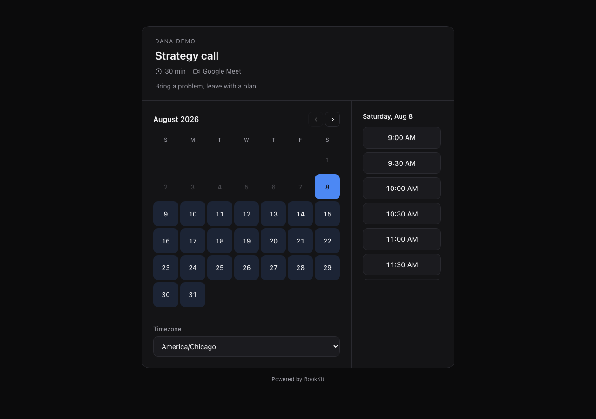
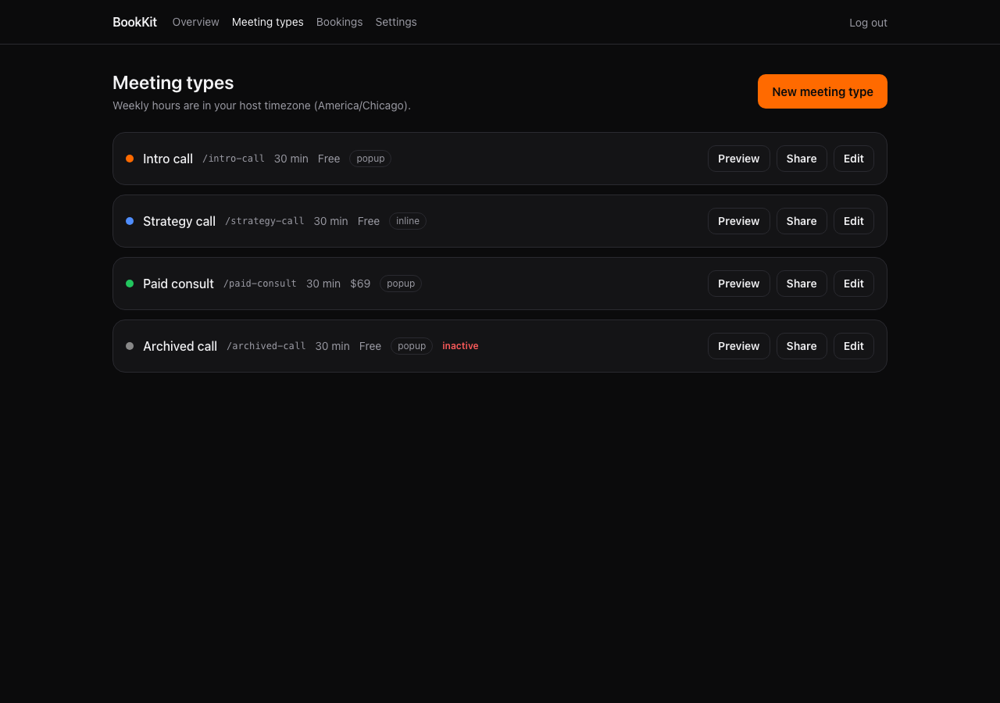
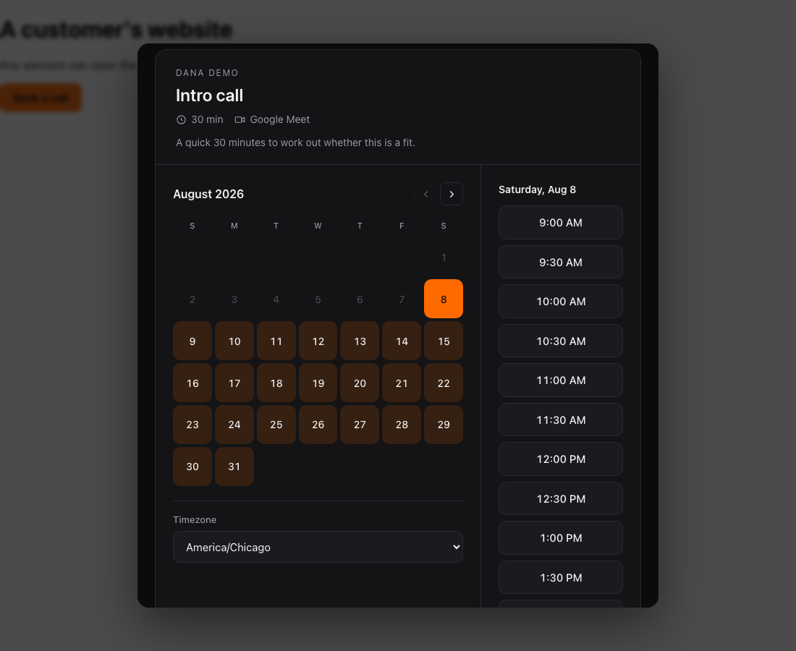
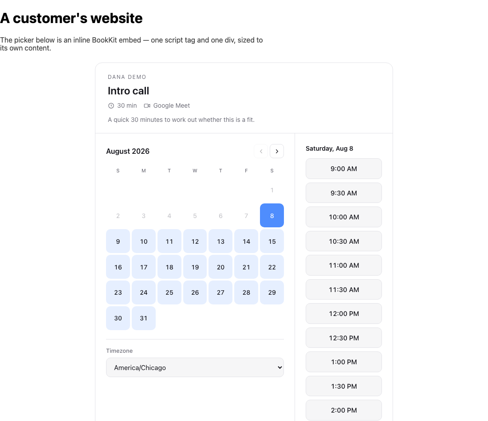
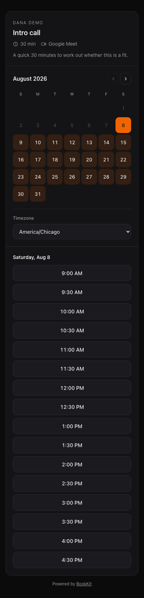

# BookKit

[](https://github.com/nchemb/bookkit/actions/workflows/ci.yml)
[](LICENSE)

A self-hosted Calendly replacement. One Next.js app that reads your real Google
Calendar availability, writes events with Google Meet links, and takes Stripe
payments for the meetings you charge for.



- **Free and paid meeting types** — put a price on a type and the slot is held
  while the booker checks out.
- **Popup or inline embeds** — one `widget.js` does both, plus plain iframes.
- **No double bookings** — every booking is claimed under a Postgres advisory
  lock that re-checks your live calendar before committing.
- **No silent failures** — if a payment lands and the calendar write fails, you
  get an alert and a retry button rather than a lost booking.
- **No cron jobs** — holds expire lazily and via Stripe's own
  `checkout.session.expired`.
- **Your data, your database.** No accounts, no vendor, no per-seat pricing.

MIT licensed.

---

## Self-host in ~20 minutes

You need: a Postgres database, a Google account, a Vercel account, and (only if
you want paid bookings) Stripe.

### 1. Clone and install

```bash
git clone https://github.com/nchemb/bookkit.git
cd bookkit
npm install
cp .env.example .env
```

### 2. Database

Any Postgres works. On Supabase (free tier):

- Create a project, then **Project Settings → Database → Connection string**.
- `DATABASE_URL` = the **transaction pooler** string (port `6543`), with
  `?pgbouncer=true&connection_limit=1` appended.
- `DIRECT_URL` = the **session pooler** string (port `5432`). Migrations use this.

Prefer to run it locally? `docker compose up -d` starts Postgres on port 5433,
and the matching URLs are commented at the bottom of `.env.example`.

```bash
npx prisma migrate deploy
```

### 3. Google Calendar OAuth

In the [Google Cloud console](https://console.cloud.google.com):

1. Create (or pick) a project → **APIs & Services → Library** → enable **Google Calendar API**.
2. **OAuth consent screen** → if you have a Google Workspace, choose **Internal**; that skips
   app verification entirely. On a personal Gmail account choose **External** and add yourself
   as a test user.
3. **Credentials → Create credentials → OAuth client ID → Web application**. Add these
   authorized redirect URIs:
   - `http://localhost:3000/api/google/callback`
   - `https://your-domain.com/api/google/callback`
4. Copy the client ID and secret into `.env`.

Scopes requested are only `calendar.events` and `calendar.freebusy` — BookKit can read when
you are busy and write its own events, nothing else.

### 4. First run

```bash
npm run seed   # creates the host row + a starter meeting type
npm run dev
```

Open `http://localhost:3000/admin`, log in with `ADMIN_PASSWORD`, and click
**Connect Google Calendar**. Your booking page is live at `/<slug>`.



### 5. Stripe (only for paid types)

```bash
# local webhook testing
stripe listen --forward-to localhost:3000/api/stripe/webhook
# paste the printed whsec_... into STRIPE_WEBHOOK_SECRET
```

In production, add a webhook endpoint at `https://your-domain.com/api/stripe/webhook`
subscribed to `checkout.session.completed` and `checkout.session.expired`, and put its
signing secret in `STRIPE_WEBHOOK_SECRET`.

### 6. Deploy

Push to GitHub, import into Vercel, and set every variable from `.env.example`.
Set `NEXT_PUBLIC_APP_URL` and `GOOGLE_REDIRECT_URI` to your real domain, then reconnect
Google once from the deployed `/admin/settings`.

> Watch for trailing whitespace when pasting secrets into a hosting dashboard — it is a
> classic source of silent 401s. From the CLI use `echo -n "value" | vercel env add NAME production`.

---

## Embedding

Add the script once:

```html
<script src="https://your-domain.com/widget.js" defer></script>
```

**Popup** — any element with `data-bookkit-popup`, or call the API directly:

```html
<button data-bookkit-popup="strategy-call">Book a call</button>
<!-- or -->
<button onclick="BookKit.popup('strategy-call')">Book a call</button>
```



**Inline** — the picker renders straight into the page, no popup ever opens. It
reports its own height, so the iframe grows to fit rather than scrolling inside
itself:

```html
<div data-bookkit="strategy-call" data-theme="dark" data-primary-color="#FF6A00"></div>
```



**Plain iframe** — no script needed:

```html
<iframe src="https://your-domain.com/embed/strategy-call?theme=dark&primaryColor=FF6A00"
        style="width:100%;min-height:640px;border:0"></iframe>
```

Query params: `theme` (`dark` | `light`), `primaryColor`, `hideDescription`, `hideHeader`.

### Events

The widget re-emits iframe messages as `window` CustomEvents, so you can track conversions:

```js
BookKit.on("bookkit.booked", (e) => analytics.track("booked", e));
window.addEventListener("bookkit.time_selected", (e) => console.log(e.detail));
```

Events: `bookkit.time_selected`, `bookkit.booked`, `bookkit.checkout`, `bookkit.closed`.

---

## Outbound webhook

Set `WEBHOOK_URL` (env or **Admin → Settings**) and every confirmed booking POSTs:

```json
{
  "event": "booking.created",
  "booking": {
    "id": "...", "name": "...", "email": "...",
    "meetingType": "strategy-call", "startTime": "2026-09-03T15:00:00.000Z",
    "timezone": "America/New_York", "amountCents": 6900
  }
}
```

Sent with an `X-BookKit-Secret` header and a 5-second timeout. Failures are logged and
never affect the booking.

---

## How it stays correct

Every row here has tests behind it. If you change the behaviour, change the test.

| Risk | What stops it | Covered by |
| --- | --- | --- |
| Two people book one slot | Booking runs inside a Serializable transaction that first takes a `pg_advisory_xact_lock` on the host, re-checks DB overlaps *and* live Google freebusy, then inserts. The loser gets a clean 409. | `concurrency.test.ts` |
| Payment taken, no calendar event | Event creation retries 3× with backoff; if it still fails the booking becomes `FAILED_NEEDS_INTERVENTION`, you get an alert email, and the dashboard offers a retry. A booking is never `CONFIRMED` without an event id. | `calendar-failure.test.ts` |
| Slot lost during checkout | The DB hold (33 min) always outlives the Stripe session (31 min), so payment cannot land on a released slot. If it somehow does, BookKit auto-refunds, emails an apology, and alerts you. | `paid-booking.test.ts` |
| Duplicate Stripe webhooks | `stripeSessionId` is unique and the first delivery claims the booking with a conditional update. Two deliveries produce one booking and one event. | `paid-booking.test.ts` |
| Abandoned checkout blocks the slot forever | No cron needed: `checkout.session.expired` releases the hold, availability treats any hold past `expiresAt` as free, and the booking transaction retires stale holds before it inserts — so a webhook that never arrives cannot leave a slot advertised but unbookable. | `paid-booking.test.ts` |
| A forged webhook settles a booking | Stripe signature verification on the raw body, before anything is read. A failure alerts you and changes nothing. | `stripe-webhook.test.ts` |
| Someone forges an admin session | The cookie is an HMAC over its own expiry, keyed on `ADMIN_PASSWORD`. Extending the expiry invalidates the signature. | `admin-auth.test.ts` |
| Google API down while rendering availability | Fails **closed** — no slots shown. Losing a booking beats double-booking. | `calendar-failure.test.ts` |
| Google token revoked | Booking pages switch to an "email me" fallback and you get an alert. A transient blip is told apart from a real revocation and does not flag you. | `google-auth.test.ts` |
| DST / timezone drift | Everything is stored UTC; all wall-clock maths goes through Luxon in the host timezone. | `availability.test.ts` |

Email and outbound webhooks are deliberately non-fatal — Google's own calendar invite is the
primary confirmation channel, so a Resend outage cannot cost a booking.

---

## Commands

```bash
npm run dev              # local dev
npm run build            # prisma generate + next build
npm run seed             # host row + starter meeting type
npm run db:up            # Postgres via docker compose

npm run typecheck
npm run lint
npm test                 # unit + integration
npm run test:integration # real Postgres; needs db:up
npm run test:e2e         # Playwright against a production build
npm run test:all         # everything, in the order CI runs it

npx prisma studio        # browse the database
```

No test needs a Google account, a Stripe account, or a network connection — see
[CONTRIBUTING.md](CONTRIBUTING.md) for how that works, and for the guard that
stops the suite running against your live keys.

---

## Adding a calendar backend

Nothing outside `lib/google.ts` talks to Google. Everything goes through
`calendar()` in `lib/calendar.ts`, which returns a `CalendarPort` — the Google
one normally, an in-memory one for tests and the demo. Implement the interface,
register it there, and the rest of the app is unchanged.

## Mobile



## Not included

Multi-host / round-robin, SMS reminders, group events, two-way calendar sync, waitlists.
BookKit is deliberately a solo-operator tool. If you need those,
[Cal.com](https://cal.com) is open source and does them well.

## Contributing

See [CONTRIBUTING.md](CONTRIBUTING.md). Security issues: [SECURITY.md](SECURITY.md).
