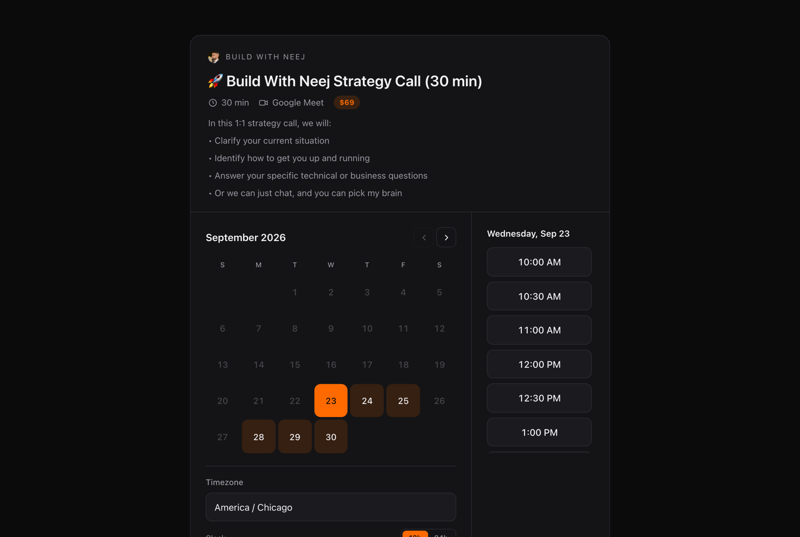
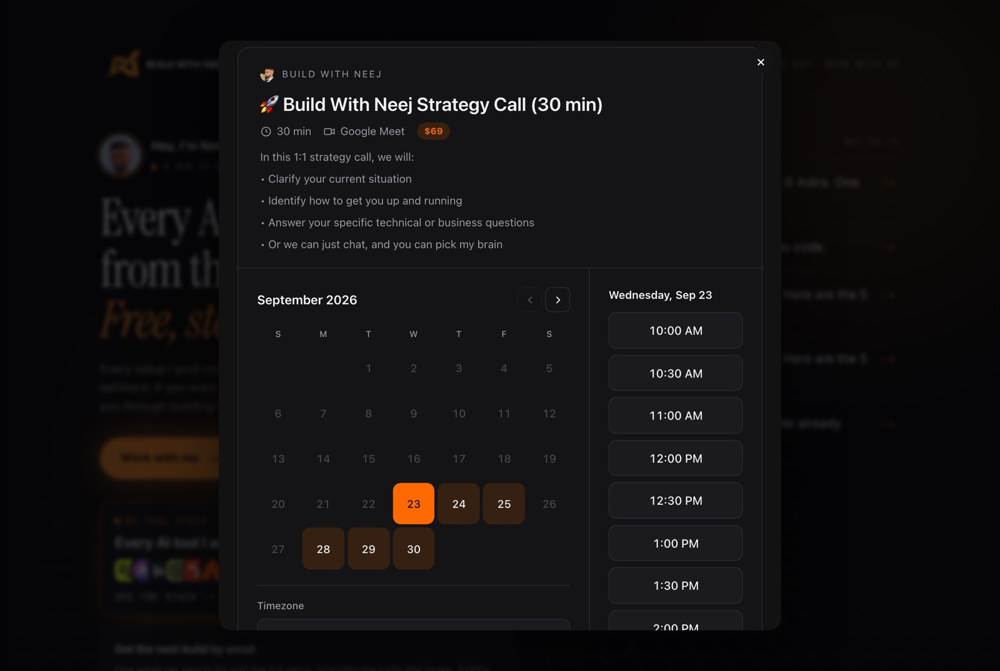
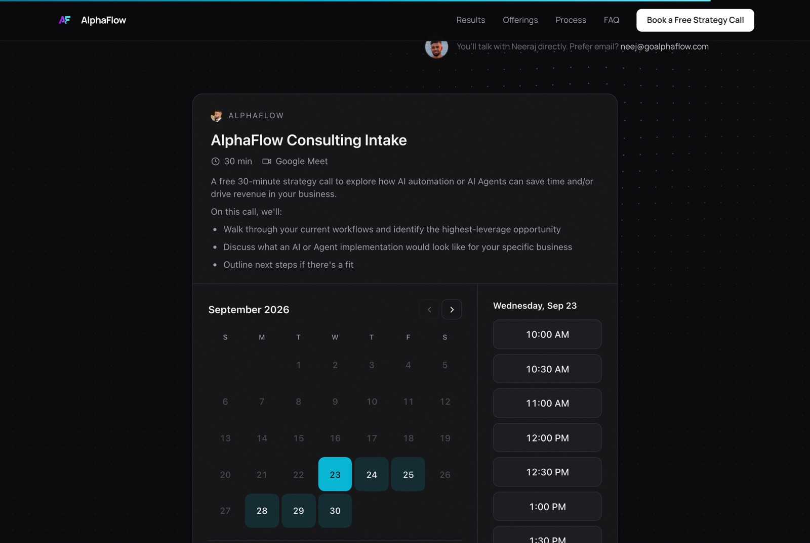
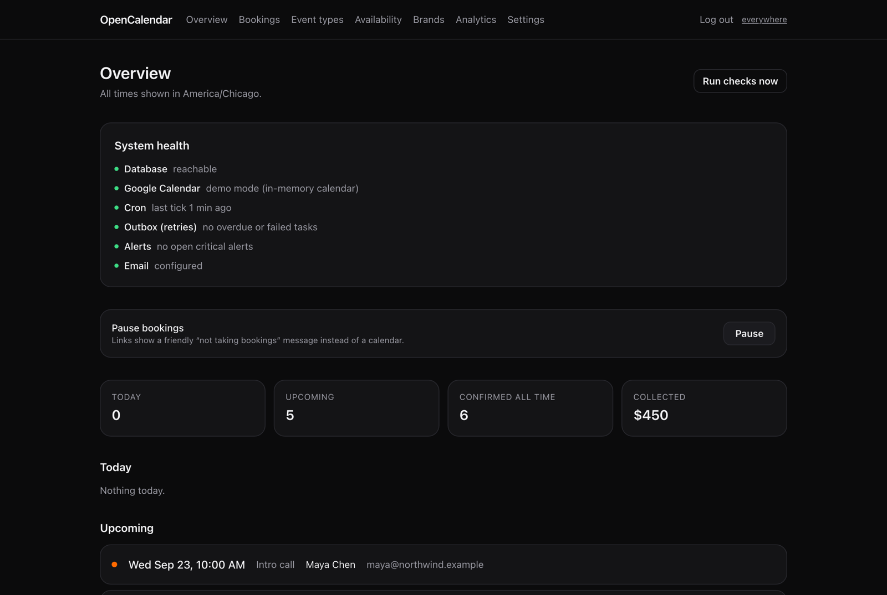
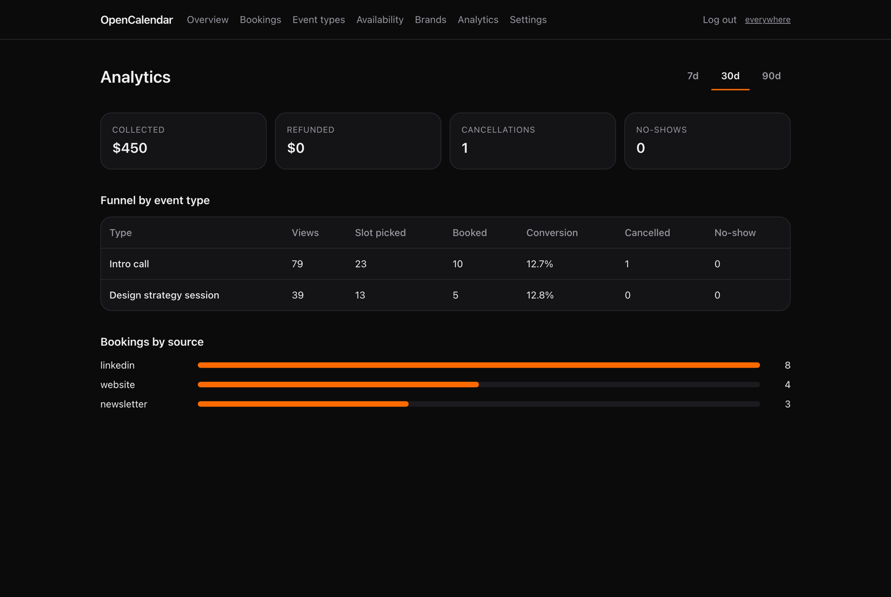
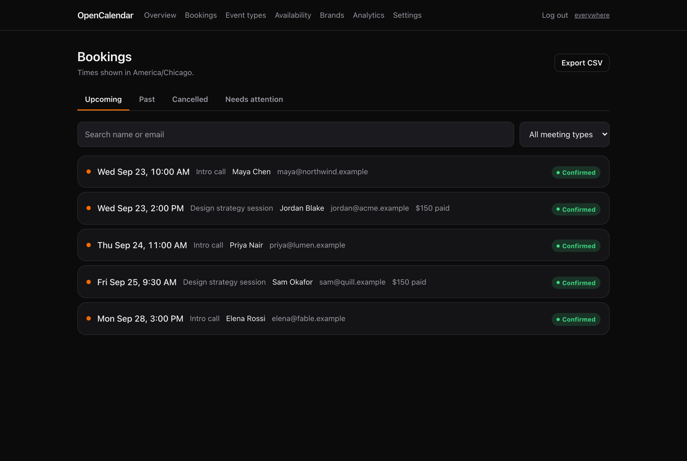
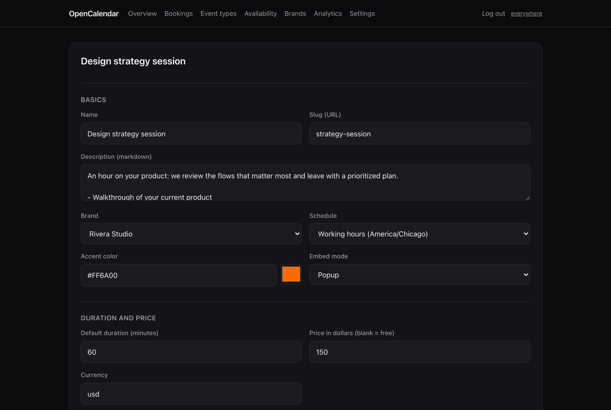
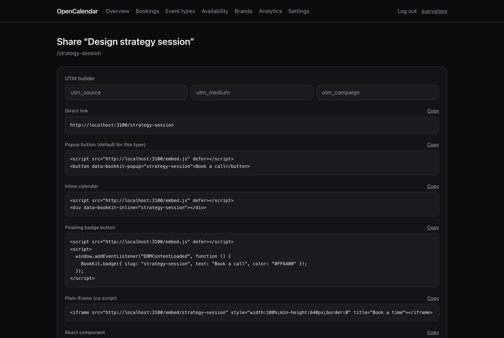
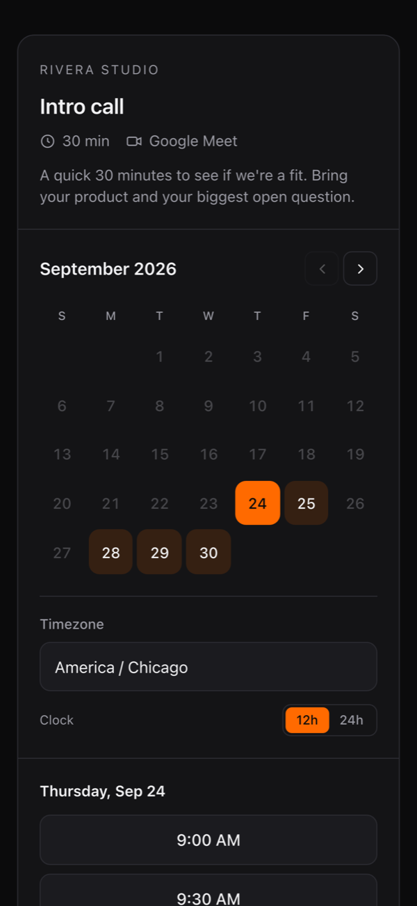

# OpenCalendar

[](https://github.com/nchemb/opencalendar/actions/workflows/ci.yml)
[](LICENSE)

**The open-source Calendly alternative.** Self-hosted: one Next.js app that reads your real
Google Calendar, takes bookings from any website or social bio, charges with Stripe when
you want it to, and never loses or double-books a meeting.

<p align="center">
  
</p>


**Why it exists:** booking links are revenue infrastructure. If one breaks quietly you lose
calls you'll never know about. OpenCalendar is built around that: every booking is claimed under
a database lock against your live calendar, every side effect is retried from a durable
outbox, and anything that goes wrong shows up as an alert, not a log line.

## What you get

- **Booking links** — free or paid, one or several durations, Google Meet / Zoom link /
  phone / in-person / custom locations, up to 10 questions of six types, guests,
  single-use links, secret links.
- **Availability like Calendly** — named schedules, date overrides, start-time increments,
  buffers before and after, minimum notice, rolling calendar-day or business-day windows,
  fixed date ranges, daily and weekly limits, a pause switch, and a "why is this time not
  offered?" troubleshooter.
- **Any number of calendars** checked for conflicts; pick which one bookings are written to.
- **Invitee self-service** — reschedule and cancel links, with an optional *enforced* cutoff
  (Calendly only lets you write a policy) and automatic refunds by policy.
- **Paid bookings** — Stripe card form inline on the page (Apple/Google Pay, Link), slot
  held while they pay, safe on a Stripe account shared with other apps.
- **Emails** — confirmation, host notification, reminders (any offsets), follow-up,
  reschedule and cancellation notices, all branded per site.
- **Embed anywhere** — one script tag for popup, inline, or floating badge; plain links and
  iframes; a React component; a link-in-bio page per brand with share images; QR codes.
  Swapping from Calendly can be a one-line change.
- **Brands** — run several sites from one install, each with its own name, logo, colors and
  profile page.
- **Webhooks, REST API and an MCP server** — so Zapier, your CRM, or your own AI agent can read
  your availability and manage your bookings.
- **Agent-bookable** — any AI agent can find you through `/llms.txt` and book the event types you
  opt in over a public, keyless MCP endpoint. Free meetings book straight through the same
  double-booking-safe path as a human; paid ones hand back a checkout link for a person to pay.
- **Analytics** — views → time picked → booked, by source, plus revenue, cancellations and
  no-shows. No cookies, no trackers.
- **Your data, your database.** No accounts, no vendor, no per-seat pricing. MIT licensed.

## Screenshots

<table>
  <tr>
    <td width="50%"><br><sub><b>Popup embed.</b> One script tag; opens instantly because it preloads.</sub></td>
    <td width="50%"><br><sub><b>Inline embed.</b> Sizes itself to its content and takes each brand's colors.</sub></td>
  </tr>
  <tr>
    <td><br><sub><b>Overview.</b> System health, today's calls, revenue, one-click pause.</sub></td>
    <td><br><sub><b>Analytics.</b> Views → time picked → booked, per event type and source.</sub></td>
  </tr>
  <tr>
    <td><br><sub><b>Bookings.</b> Search, filter, refund, reschedule, export CSV.</sub></td>
    <td><br><sub><b>Event types.</b> Price, durations, windows, buffers, questions, policies.</sub></td>
  </tr>
  <tr>
    <td><br><sub><b>Share.</b> Every embed snippet, a UTM builder and a QR code.</sub></td>
    <td align="center"><br><sub><b>Mobile.</b> Built for traffic from social bios.</sub></td>
  </tr>
</table>

Admin screenshots use made-up demo data.

## Self-host in ~20 minutes

You need Postgres, a Google account, somewhere to run Next.js (Vercel works), and Stripe
only if you charge.

```bash
git clone https://github.com/nchemb/opencalendar.git && cd opencalendar
npm install
npm run setup     # writes .env, starts local Postgres, migrates, seeds, tells you what's missing
npm run dev
```

Open `http://localhost:3000/admin` (the password is in `.env`), then:

1. **Google Calendar.** In the [Google Cloud console](https://console.cloud.google.com):
   enable the Google Calendar API, create an OAuth consent screen (**Internal** on a Google
   Workspace skips verification; on Gmail choose **External** and add yourself as a test
   user), then **Credentials → OAuth client ID → Web application** with redirect URIs
   `http://localhost:3000/api/google/callback` and `https://<your-domain>/api/google/callback`.
   Put the client ID and secret in `.env`, then **Admin → Settings → Connect Google Calendar**
   and choose which calendars count as busy.
2. **Email** (strongly recommended). A [Resend](https://resend.com) API key and a verified
   from-address in `RESEND_API_KEY` / `RESEND_FROM`.
3. **Alerts.** Set `ALERT_WEBHOOK_URL` to a Slack or Discord webhook or an
   [ntfy](https://ntfy.sh) topic to get pushed to your phone when anything needs you.
4. **Stripe** (paid types only). `STRIPE_SECRET_KEY`, `NEXT_PUBLIC_STRIPE_PUBLISHABLE_KEY`,
   and a webhook to `https://<your-domain>/api/stripe/webhook` for
   `checkout.session.completed`, `checkout.session.expired` and `payment_intent.succeeded`
   with its secret in `STRIPE_WEBHOOK_SECRET`.
5. **Scheduler.** Call `/api/cron/tick` every 5–10 minutes with
   `Authorization: Bearer $CRON_SECRET` — retries, reminders and health checks run there.
   The included `vercel.json` does it on Vercel Pro; see
   [docs/RELIABILITY.md](docs/RELIABILITY.md) for GitHub Actions, cron and uptime-monitor
   options.

**Deploy:** push to GitHub, import into Vercel, copy every variable from `.env` (watch for
trailing whitespace in pasted secrets, a classic silent-401), set `NEXT_PUBLIC_APP_URL` and
`GOOGLE_REDIRECT_URI` to your domain, and reconnect Google once from the deployed admin.
Use a Postgres that never pauses: a free database that sleeps after a week idle will take
your booking pages down with it.

Coming from Calendly? `npm run import:calendly -- https://calendly.com/<you>` copies your
event types, questions, prices and hours. See [docs/MIGRATE-FROM-CALENDLY.md](docs/MIGRATE-FROM-CALENDLY.md).

### Admin password

`/admin` has one owner login: the `ADMIN_PASSWORD` environment variable. `npm run setup`
generates a random one, prints it once and saves it in `.env`; in production set it in your
host's env vars. There is no "forgot password" email on purpose: whoever can change the env var
owns the instance, so recovery is "set a new `ADMIN_PASSWORD` and redeploy". The password also
signs the session cookie, so changing it logs out every browser (so does **Log out everywhere**).

## Put it on your site

```html
<script src="https://<your-domain>/embed.js" defer></script>

<!-- popup -->
<button data-bookkit-popup="strategy-call">Book a call</button>

<!-- inline, sizes itself to its content -->
<div data-bookkit-inline="strategy-call"></div>
```

The project was called BookKit before it was renamed, so the embed API keeps that name
(`window.BookKit`, `data-bookkit-*`, `bookkit:*` events, the `BookKit-Signature` webhook header
and `BOOKKIT_*` env vars). Existing embeds keep working.

Social bio: link to `https://<your-domain>/u/<brand>`. Everything else (badge, React,
Webflow, WordPress, Framer, Squarespace, email signature, analytics events) is in
[docs/EMBED.md](docs/EMBED.md). The API is in [docs/API.md](docs/API.md), webhooks in
[docs/WEBHOOKS.md](docs/WEBHOOKS.md), and AI-agent booking over MCP in [docs/MCP.md](docs/MCP.md).

## How it stays correct

Every row has tests behind it (`npm test` runs them against a real Postgres).

| Risk | What stops it | Tests |
| --- | --- | --- |
| Two people book one slot | The claim runs in a Serializable transaction holding a per-host `pg_advisory_xact_lock`, re-checks DB overlaps, limits **and live free/busy on every conflict calendar**, then inserts. One wins; the rest get a clean 409. | `concurrency`, `v2-booking` |
| A calendar is unreadable | Fails closed: no slots shown, no bookings taken. An error on any one conflict calendar counts. | `calendar-failure`, `google-auth` |
| Calendar write fails after the slot is claimed | The booking stays confirmed (it's the invitee's slot), a `calendar.create` job retries with backoff, and you get a critical alert until the event lands. | `calendar-failure` |
| An email, webhook, reminder or refund fails | Everything after the booking row is a job in a durable outbox, claimed with `SKIP LOCKED`, retried with backoff, and turned into an alert if it finally dies. Nothing is dropped silently. | `v2-booking`, `v2-ops` |
| Payment lands on a slot someone else took | Hold (33 min) outlives the Stripe session (31 min). If it still happens: automatic refund, apology email, alert. | `paid-booking` |
| A Stripe webhook is late, duplicated, forged, or from another app on the same account | Signature-verified; claimed once with a conditional update; ignored unless it matches an object OpenCalendar created; and the booking page and cron **pull** payment status from Stripe, so a missing webhook never strands a payer. | `stripe-webhook`, `paid-booking`, `v2-booking` |
| An abandoned hold burns a slot | Holds expire lazily and are swept inside the booking lock and by the cron — including holds that died before payment ever started. | `paid-booking`, `v2-ops` |
| Your booking page silently offers nothing | A canary checks every public link can read the calendar and has open times; you're alerted if not. `/api/health` returns 503 for uptime monitors. | `v2-ops` |
| You delete or move a booked meeting in Google by hand | Reconcile notices and alerts you with the booking, so the invitee gets told. | `v2-ops` |
| DST and timezones | Stored in UTC; wall-clock maths in the schedule's zone via Luxon, including the spring-forward and fall-back days themselves. | `slots` |
| Someone forges an admin session | HMAC-signed cookie over expiry + session version; "sign out everywhere" revokes every issued cookie. | `admin-auth` |

## Commands

```bash
npm run setup            # first run
npm run dev
npm run build
npm test                 # unit + integration (needs Postgres: npm run db:up)
npm run test:e2e         # Playwright against a production build
npm run import:calendly -- https://calendly.com/<you> --dry-run
```

No test needs a Google account, a Stripe account, or the network — see
[CONTRIBUTING.md](CONTRIBUTING.md).

## Adding a calendar backend

Everything talks to calendars through `CalendarPort` (`lib/calendar-types.ts`): free/busy,
create, update, delete, get, list. Google and an in-memory backend ship; Outlook or CalDAV
is one file plus a line in `lib/calendar.ts`.

## Not included

Round robin, collective and team scheduling, group events, meeting polls, SMS. OpenCalendar is a
tool for one person running one or more brands. If you need teams,
[Cal.com](https://cal.com) is open source and does them well.

## Contributing

See [CONTRIBUTING.md](CONTRIBUTING.md). Security issues: [SECURITY.md](SECURITY.md).
